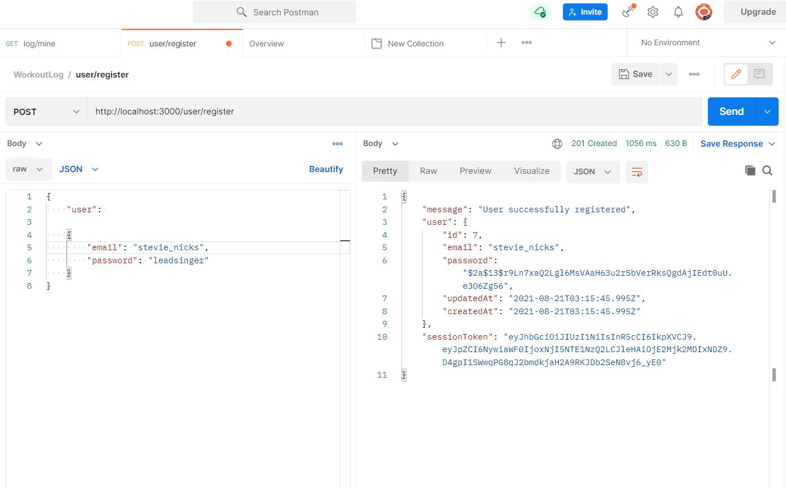
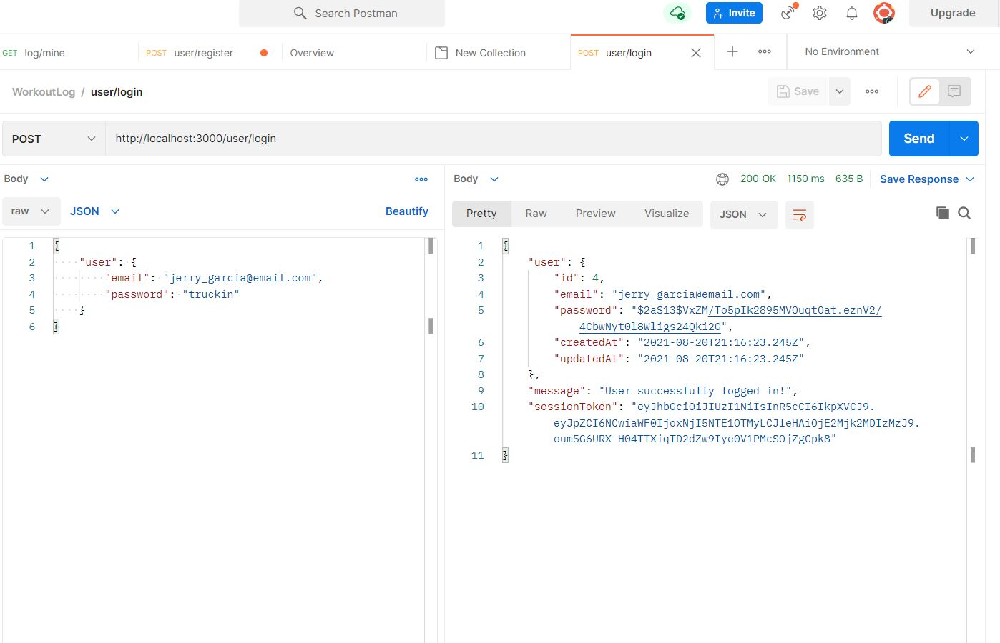
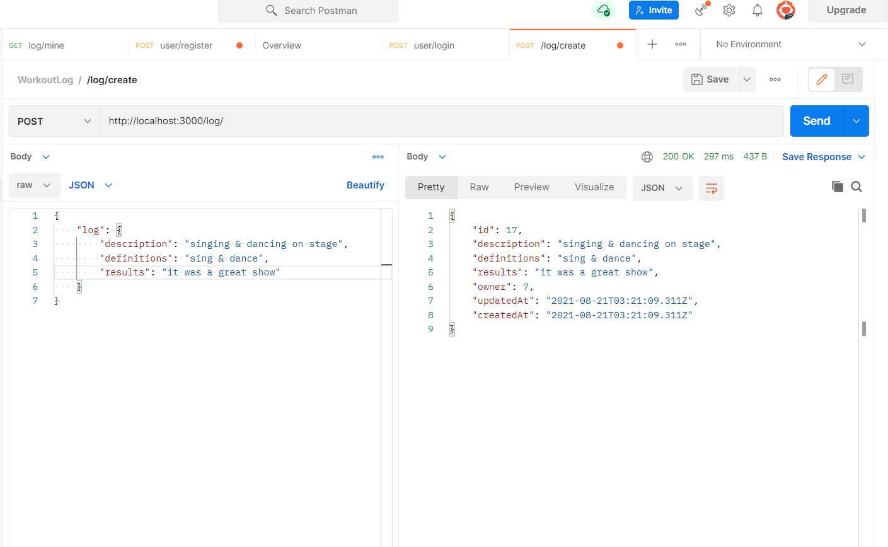
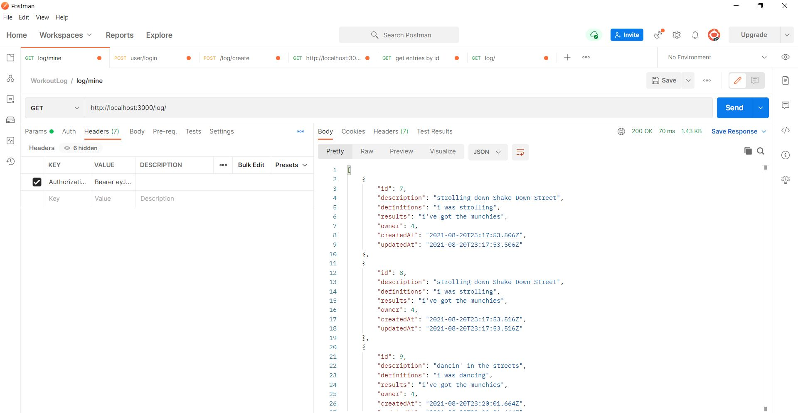
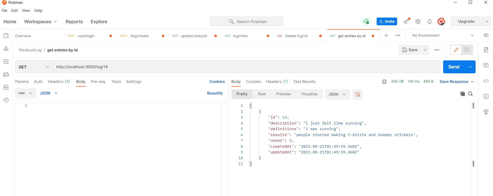
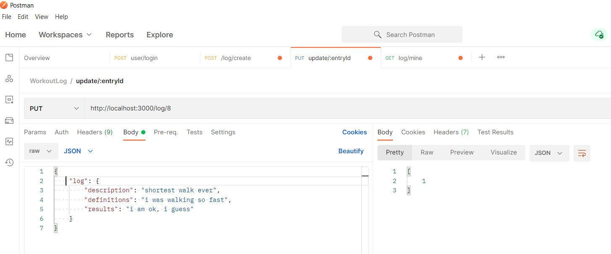
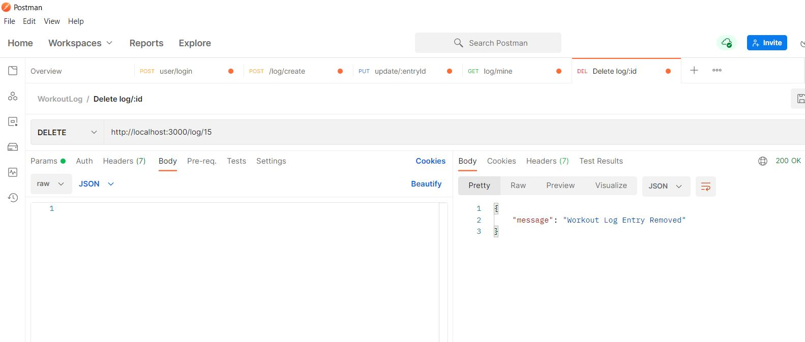

# server_wol
# workoutlog-server

## Below are the images of the required endpoints.

### __POST__  /user/register 
#### New users are allowed to create an account with an email and password.

### __POST__ /user/login
#### Current users are able to login with their email and password.

### __POST__ /log/
#### Current users are able to create a Workout Log Entry.

### __GET__ /log/
#### Get all logs for an individual user.

### __GET__ /log/:id
#### Get individual logs by id.

### __PUT__ /log/:id
#### Allows users to update individual logs.

### __DELETE__ /log/:id
#### Allows users to delete individual logs.

